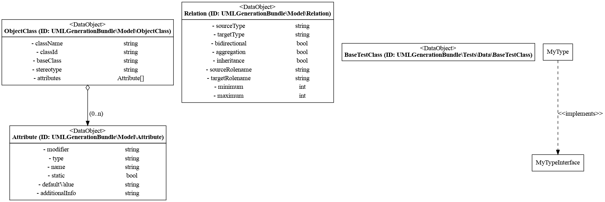

# umlgeneration-bundle
generates UML class diagrams and more based upon your class definitions

## Setup
* copy env.dist and replace USER_ID with own ID (Retrieve: `echo $(id -u)` in a terminal)

## Install

Before you can use the Bundle, you need to add the git repository to your composer.json


```SHELL
composer require "mike4git/umlgeneration-bundle"
```
and add it to your bundles.php:
```php
<?php declare(strict_types=1);

return [
    // mostly dev environment is enough
    \UMLGenerationBundle\UMLGenerationBundle::class => ['dev' => true],
];
```

Additionally, you'll have to install GraphViz (`dot` executable).
Users of Debian/Ubuntu-based distributions may simply invoke:

```bash
$ sudo apt-get install graphviz
```

Windows users have to [download GraphViZ for Windows](http://www.graphviz.org/Download_windows.php) and remaining
users should install from [GraphViz homepage](http://www.graphviz.org/Download.php).

Use the following URL for the GraphViz usage: 
[GraphViz](https://graphviz.org/doc/info/command.html)

## Usage

#### Generate dotfile:
```bash
$ php bin/console uml:generate -o myDotfileName
```
Note that this will generate a myDotfileName.dot file

#### Generate Graph:
```bash
$ dot -Tsvg myDotfileName.dot -o image.svg

```
After that you should see something like this:



Done.
